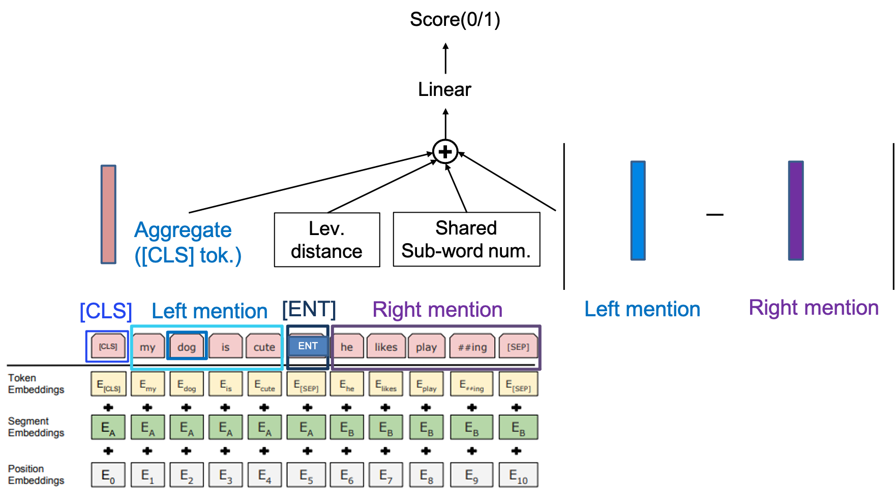

# BERTを用いた名寄せ解消
* https://github.com/yagays/nayose-wikipedia-ja　
* 上記データセットを用いた名寄せ解消

# モデル
* [InferSent](https://github.com/facebookresearch/InferSent) を一部参考に以下のモデルを組んだ。

# 結果
* dev acc. ~%63 ,test acc. ~ 66% なので要改良。
* 例えば [この論文](https://www.aclweb.org/anthology/2020.emnlp-main.363/) で使用している特徴量を組み込むことが考えられる。

